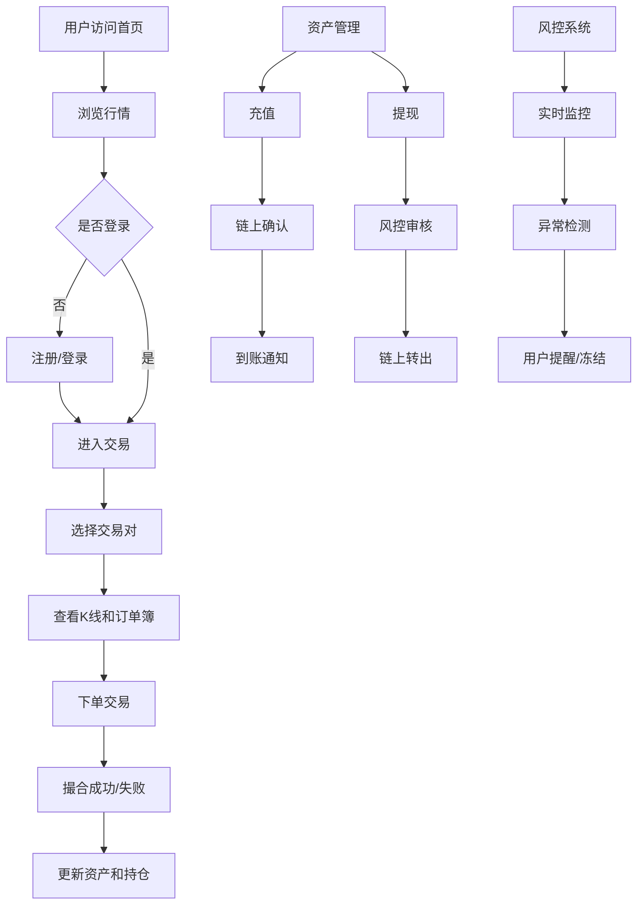

## 1. 产品概述

NovaExchange 是一个中心化加密货币交易所网页版，主打Solana生态资产交易，提供现货交易、合约交易、充值提现、资产管理、行情展示和风控系统六大核心模块。平台首发RS新币（合约地址：GAswtBAGV5NybYWN7YX9aTuJNkps4uft4Qjb4N31bonk），初始价格0.15 USDT。

- **目标用户**：加密货币交易者、Solana生态投资者、新币挖矿参与者
- **核心价值**：专业级交易体验 + 丰富的Solana生态资产 + 严格风控保障
- **市场定位**：专注Solana生态的新锐中心化交易所

## 2. 核心功能

### 2.1 用户角色

| 角色 | 注册方式 | 核心权限 |
|------|----------|----------|
| 普通用户 | 邮箱/手机号注册 | 浏览行情、交易、充值提现、资产管理 |
| VIP用户 | 交易量达标升级 | 更低手续费、专属客服、优先上币投票 |

### 2.2 功能模块

1. **首页**：行情概览、热门币种、平台公告、新手引导
2. **现货交易**：K线图表、订单簿、交易面板、成交记录
3. **合约交易**：永续合约、杠杆调整、持仓管理、资金费率
4. **行情中心**：全币种行情、涨跌幅排行、24H成交额、自选行情
5. **资产管理**：总资产概览、币币账户、合约账户、流水记录
6. **充值提现**：链上充币、提币申请、地址管理、充值记录
7. **风控中心**：安全设置、风控提示、异常检测、账户保护

### 2.3 页面详情

| 页面名称 | 模块名称 | 功能描述 |
|----------|----------|----------|
| 首页 | 导航栏 | Logo、搜索、语言切换、登录注册按钮 |
| 首页 | Hero区域 | 平台 slogan、RS新币上线 banner、快速入口 |
| 首页 | 行情概览 | BTC/ETH/SOL/RS 实时价格、涨跌幅、24H成交额 |
| 首页 | 热门币种 | 涨幅榜、跌幅榜、成交额榜，可切换 |
| 首页 | 平台公告 | 最新公告列表、活动通知 |
| 首页 | 底部信息 | 关于我们、服务条款、安全说明、联系方式 |
| 现货交易 | 交易对选择 | 搜索交易对、收藏、常用交易对列表 |
| 现货交易 | K线图表 | TradingView K线、多周期切换、技术指标 |
| 现货交易 | 订单簿 | 买卖盘口、深度图、实时更新 |
| 现货交易 | 交易面板 | 限价/市价单、买入卖出、数量金额输入 |
| 现货交易 | 成交记录 | 最新成交、我的历史订单 |
| 合约交易 | 合约类型 | 永续合约、交割合约选择 |
| 合约交易 | 杠杆调整 | 1-125倍杠杆滑块调节 |
| 合约交易 | 持仓面板 | 当前持仓、保证金、未实现盈亏 |
| 合约交易 | 资金费率 | 当前资金费率、历史记录 |
| 行情中心 | 行情列表 | 全部币种、搜索筛选、排序 |
| 行情中心 | 自选行情 | 用户自选币种、实时价格提醒 |
| 资产管理 | 资产概览 | 总资产估值、各账户余额分布 |
| 资产管理 | 币币账户 | 各币种余额、可用/冻结、估值 |
| 资产管理 | 合约账户 | 合约保证金、未实现盈亏 |
| 资产管理 | 流水记录 | 充值、提现、交易、手续费流水 |
| 充值提现 | 充币 | 选择币种、获取充值地址、充值记录 |
| 充值提现 | 提币 | 输入地址、数量、网络手续费、提币记录 |
| 充值提现 | 地址管理 | 保存常用地址、地址白名单 |
| 风控中心 | 安全设置 | 登录密码、资金密码、2FA验证 |
| 风控中心 | 风控提示 | 异常登录提醒、高危操作验证 |
| 风控中心 | 账户保护 | 提现地址白名单、防钓鱼码 |

## 3. 核心流程

## 4. 用户界面设计

### 4.1 设计风格

- **主色调**：深空蓝 #0B0E14（背景）、科技蓝 #3B82F6（主色）
- **辅助色**：霓虹绿 #10B981（上涨）、烈焰红 #EF4444（下跌）、金色 #F59E0B（强调）
- **按钮风格**：直角微圆角（4px）、实心主按钮、幽灵次要按钮、悬停发光效果
- **字体**：标题使用 Space Grotesk，正文使用 Inter Mono，数字使用等宽字体
- **布局风格**：暗色主题、卡片式布局、玻璃拟态效果、网格系统
- **图标风格**：线性图标、细线条、统一2px描边

### 4.2 页面设计概览

| 页面名称 | 模块名称 | UI元素 |
|----------|----------|--------|
| 首页 | Hero区域 | 渐变背景、大标题、RS新币卡片、动效数字 |
| 首页 | 行情概览 | 四列卡片、实时价格跳动、涨跌幅颜色标识 |
| 首页 | 热门币种 | Tab切换、排行榜、悬停高亮 |
| 现货交易 | 整体布局 | 三栏布局：左侧交易对+中间K线+右侧交易面板 |
| 现货交易 | 订单簿 | 红绿色差、深度渐变、实时刷新动画 |
| 现货交易 | K线区域 | TradingView嵌入、周期切换按钮组 |
| 合约交易 | 杠杆调节 | 滑块控件、杠杆倍数预览、风险提示 |
| 行情中心 | 列表 | 斑马纹、排序箭头、收藏星标 |
| 资产管理 | 概览 | 资产卡片、饼图分布、数字动画 |
| 充值提现 | 地址展示 | 二维码、复制按钮、地址格式校验 |

### 4.3 响应式

- **设计原则**：Desktop-first，移动端自适应
- **断点设置**：1280px（桌面）、768px（平板）、480px（手机）
- **移动端优化**：
  - 交易页面简化为上下布局（K线上方，交易面板下方）
  - 底部Tab导航替代顶部导航
  - 触摸友好的按钮尺寸（最小44px）
  - 关键数据优先展示，次要信息折叠

### 4.4 动效设计

- **页面加载**：元素渐入 + 轻微上移动画（0.3-0.5s）
- **价格更新**：数字跳动动画、涨跌幅颜色闪烁（绿/红）
- **悬停效果**：按钮发光、卡片上浮、边框高亮
- **下单反馈**：按钮按压效果、成交成功动画提示
- **K线加载**：骨架屏 + 渐显效果
