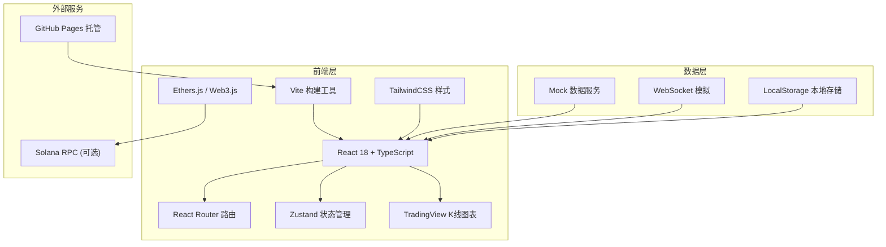

## 1. 架构设计



## 2. 技术描述

- **前端框架**：React 18 + TypeScript 5
- **构建工具**：Vite 5
- **样式方案**：TailwindCSS 3 + CSS Variables
- **路由管理**：React Router v6
- **状态管理**：Zustand（轻量级状态管理）
- **UI组件**：Headless UI + 自定义组件
- **图表库**：lightweight-charts（TradingView开源版）
- **图标库**：Lucide React
- **数字格式化**：numeral.js / bignumber.js
- **部署平台**：GitHub Pages
- **数据方案**：前端 Mock 数据 + localStorage 持久化（演示用）

## 3. 路由定义

| 路由路径 | 页面名称 | 说明 |
|----------|----------|------|
| / | 首页 | 行情概览、热门币种、平台公告 |
| /trade/:pair | 现货交易 | :pair 为交易对，如 BTC_USDT |
| /futures/:pair | 合约交易 | 永续合约交易页面 |
| /markets | 行情中心 | 全部币种行情列表 |
| /assets | 资产管理 | 资产总览、账户余额 |
| /assets/deposit | 充值 | 链上充币页面 |
| /assets/withdraw | 提现 | 提币申请页面 |
| /assets/history | 流水记录 | 充值提现交易流水 |
| /risk | 风控中心 | 安全设置、风控提示 |
| /login | 登录 | 用户登录页面 |
| /register | 注册 | 用户注册页面 |

## 4. 数据模型

### 4.1 核心数据结构

```typescript
// 币种信息
interface Coin {
  id: string;
  symbol: string;
  name: string;
  icon: string;
  price: number;
  change24h: number;
  volume24h: number;
  marketCap: number;
  high24h: number;
  low24h: number;
  circulatingSupply: number;
  contractAddress?: string;
  chain: string;
}

// 交易对
interface TradingPair {
  symbol: string;  // e.g., "BTC_USDT"
  baseAsset: string;
  quoteAsset: string;
  lastPrice: number;
  change24h: number;
  high24h: number;
  low24h: number;
  volume24h: number;
  pricePrecision: number;
  amountPrecision: number;
  minAmount: number;
  minTotal: number;
}

// 订单簿
interface OrderBook {
  symbol: string;
  asks: OrderBookEntry[];  // 卖单
  bids: OrderBookEntry[];  // 买单
  timestamp: number;
}

interface OrderBookEntry {
  price: number;
  amount: number;
  total: number;
}

// K线数据
interface KlineData {
  time: number;
  open: number;
  high: number;
  low: number;
  close: number;
  volume: number;
}

// 账户资产
interface AccountBalance {
  coin: string;
  total: number;
  available: number;
  frozen: number;
  usdtValue: number;
}

// 订单
interface Order {
  id: string;
  symbol: string;
  type: 'limit' | 'market';
  side: 'buy' | 'sell';
  price: number;
  amount: number;
  filledAmount: number;
  totalAmount: number;
  status: 'pending' | 'filled' | 'partially_filled' | 'cancelled';
  fee: number;
  feeCoin: string;
  createdAt: number;
}

// 合约持仓
interface Position {
  symbol: string;
  side: 'long' | 'short';
  size: number;
  entryPrice: number;
  markPrice: number;
  leverage: number;
  margin: number;
  unrealizedPnl: number;
  realizedPnl: number;
  liquidationPrice: number;
}

// 充值记录
interface DepositRecord {
  id: string;
  coin: string;
  amount: number;
  txHash: string;
  fromAddress: string;
  toAddress: string;
  status: 'pending' | 'confirmed' | 'failed';
  confirmations: number;
  requiredConfirmations: number;
  createdAt: number;
}

// 提币记录
interface WithdrawRecord {
  id: string;
  coin: string;
  amount: number;
  fee: number;
  txHash: string;
  toAddress: string;
  status: 'pending' | 'processing' | 'success' | 'failed' | 'cancelled';
  createdAt: number;
}

// 用户信息
interface User {
  id: string;
  email: string;
  nickname: string;
  avatar: string;
  level: number;
  vipLevel: number;
  kycStatus: 'unverified' | 'pending' | 'verified' | 'rejected';
  security: {
    twoFA: boolean;
    withdrawWhitelist: boolean;
    antiPhishingCode: boolean;
  };
  createdAt: number;
}
```

### 4.2 初始数据（RS新币）

```typescript
const RS_COIN: Coin = {
  id: 'rs',
  symbol: 'RS',
  name: 'RuneStone',
  icon: '💎',
  price: 0.15,
  change24h: 0,
  volume24h: 1000000,
  marketCap: 15000000,
  high24h: 0.155,
  low24h: 0.145,
  circulatingSupply: 100000000,
  contractAddress: 'GAswtBAGV5NybYWN7YX9aTuJNkps4uft4Qjb4N31bonk',
  chain: 'solana'
};

const RS_USDT_PAIR: TradingPair = {
  symbol: 'RS_USDT',
  baseAsset: 'RS',
  quoteAsset: 'USDT',
  lastPrice: 0.15,
  change24h: 0,
  high24h: 0.155,
  low24h: 0.145,
  volume24h: 1000000,
  pricePrecision: 4,
  amountPrecision: 2,
  minAmount: 10,
  minTotal: 1
};
```

## 5. 核心模块设计

### 5.1 交易引擎（Mock）

- 模拟订单簿实时更新
- 模拟撮合逻辑
- 模拟价格波动（随机游走模型）
- WebSocket 模拟推送

### 5.2 风控系统

- 登录异常检测（IP、设备）
- 提币地址白名单
- 大额提币审核
- 2FA 双重验证
- 异常操作告警

### 5.3 资产管理

- 多账户体系（币币账户、合约账户）
- 资产划转
- 流水记录
- 资产估值计算

## 6. 性能优化

- 组件懒加载（React.lazy + Suspense）
- 虚拟列表（行情列表、订单列表）
- Web Worker 处理计算
- 防抖节流（搜索、价格更新）
- 图片懒加载
- 代码分割（按路由分割）

## 7. 部署方案

- **构建命令**：`npm run build`
- **输出目录**：`dist/`
- **托管平台**：GitHub Pages
- **CI/CD**：GitHub Actions 自动部署
- **域名**：GitHub Pages 默认域名 / 自定义域名
